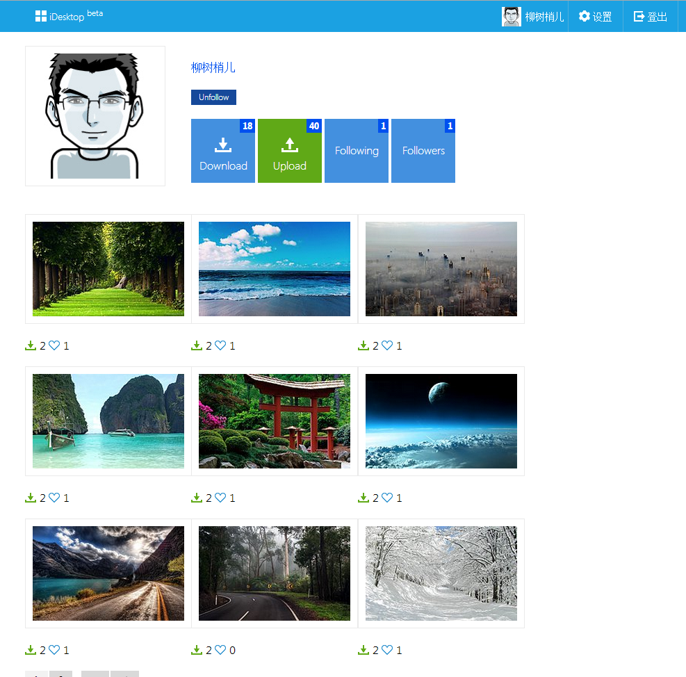
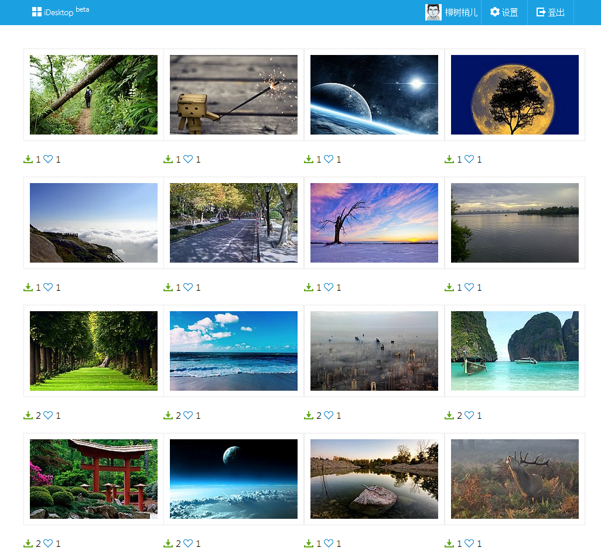
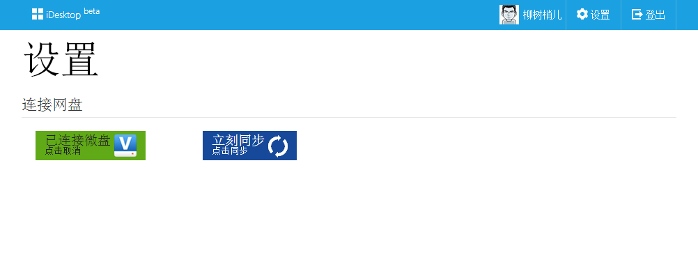

iDesktop
========

### 简介
iDesktop，提供基于网盘同步的壁纸分享服务类似国外的[Desktoppr](https://www.desktoppr.co)。用户使用iDesktop的服务必须授权
iDesktop访问用户的网盘文件夹下的一个idesktop目录，用户在网站上点击的下载按钮的壁纸会自动同步到idesktop目录。
用户也可以通过在idesktop放入自己的壁纸，壁纸会自动上传到网站。

查看[DEMO](http://idesktop.sturgeon.mopaas.com/)

### 使用到的技术
- 后端
    - [Flask](http://flask.pocoo.org/) Web框架，好用不多说
    - [Flask-Security](http://pythonhosted.org/Flask-Security/index.html) Flask 扩展,
    集成了用户登录、注册等基本功能，使用方便，功能强大，包含Flask-Login,Flask-Mail,Flask-Principal,Flask-Script,Flask-WTF,itsdangerous,passlib等库。
    - [Flask-SQLAlchemy](http://pythonhosted.org/Flask-SQLAlchemy/) ORM，Flask必备
    - [Flask-Migrate](https://github.com/miguelgrinberg/Flask-Migrate)
    SQLAlchemy database migrations for Flask applications using Alembic
    - [RQ](http://python-rq.org/) RQ (Redis Queue)，简单的Python消息队列
    - [RQ-Dashboard](https://github.com/nvie/rq-dashboard) 实时显示RQ的worker和jobs
    - [Requests](http://docs.python-requests.org/en/latest/) HTTP for Humans
    - [APScheduler](http://pythonhosted.org/APScheduler/#advanced-python-scheduler)
    Advanced Python Scheduler Python中提供类似cron的功能
- 前端
    - [Bower](http://bower.io/) 好用的前端包管理器，自动下载并维护前端开发中的常用包
    - [Bootstrap](http://getbootstrap.com/) 响应式前端框架
    - [jQuery](http://jquery.com/) JavaScript库，主要是使用简单
    - [Metro UI CSS](http://metroui.org.ua/) 高端大气的metro风格的bootstrap
    - [Lightbox2](http://lokeshdhakar.com/projects/lightbox2/) 在前台打开图片的JavaScript库，轻巧，漂亮
- 其他
    - [MySQL](http://www.mysql.com/) 数据库
    - [Redis](http://redis.io/) 为消息队列和统计用户数提供强力支持
    - [Sentry](https://getsentry.com/welcome/) 收集生产环境中产生的错误

### [DEMO](http://idesktop.sturgeon.mopaas.com/)截图

